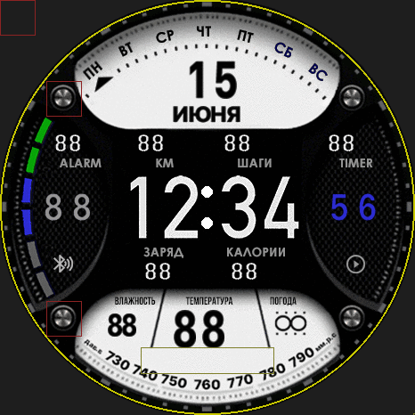

# T-REX Watch Face for Amazfit Balance 2

A tactical-style **T-REX** watch face adapted for the **Amazfit Balance 2** — round 480×480 display, Zepp OS 5. The main screen shows large time, date, steps, calories, battery, alarm, timer, and a weather forecast popup.

  

## Installation

Install via **Zepp Developer Mode** by scanning a QR code — no appId registration and no account or region change required (the appId is outside the dev range, and the package is hosted here on GitHub Pages).

  

1. Open the **Zepp** app on your phone (with the Amazfit Balance 2 connected).
2. Enable **Developer Mode** in Zepp.
3. In Developer Mode, **scan the QR code** above — or open a saved QR image via "OPEN".
4. Zepp downloads the package from GitHub and installs the watch face over Bluetooth — it then appears in the watch face list.

**Direct package link:** [`T-REX_Balance2.zpk`](T-REX_Balance2.zpk) (348 KB)

QR encodes: `zpkd1://flash797.github.io/T-REX_Balance2.zpk`

## Specifications

| | |
|---|---|
| **Device** | Amazfit Balance 2 (Zepp OS 5, 480×480 round display) |
| **appId** | `8541465` — outside the dev range, installs without server registration |
| **Package size** | 348 KB (`.zpk`) |
| **Base** | adapted from the T-REX watch face for GTR 4 (466×466 → 480×480) |

## What it shows

- Large digital time (HH:MM) and date
- Alarm and timer
- Steps, calories, battery level
- Weather forecast popup (on tap)

## How the adaptation works

The watch face was adapted for the Balance 2 manually, with scripts (not through the editor — the editor applies a double resize and degrades sharpness):

- **Width as a multiple of 4** — the Zepp engine requires sprite width to be a multiple of 4 (texture alignment). The background was extended to 496×480 (overscan), which removes horizontal banding.
- **Pixel-perfect glyphs** — digits and text are taken from the original byte-for-byte, without resizing, so they stay crisp.
- **Weather popup** — forecast column coordinates were scaled ×1.03 to fit width 480 so they no longer drift to the right.

## Credits

The **T-REX** watch face design belongs to its original author (a third-party Zepp OS watch face). This repository contains only a technical adaptation for the Amazfit Balance 2. Not for commercial use.
